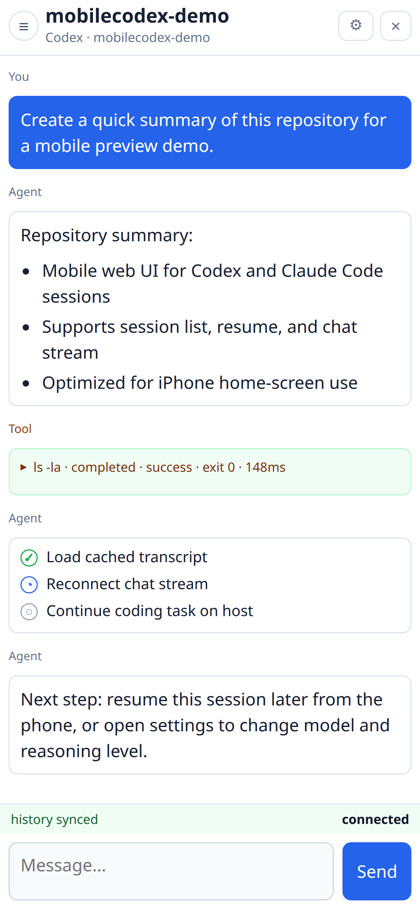
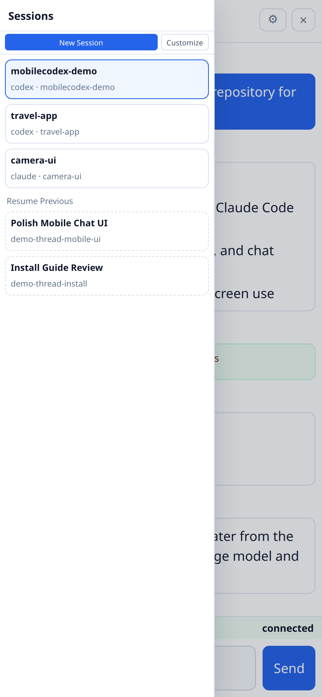
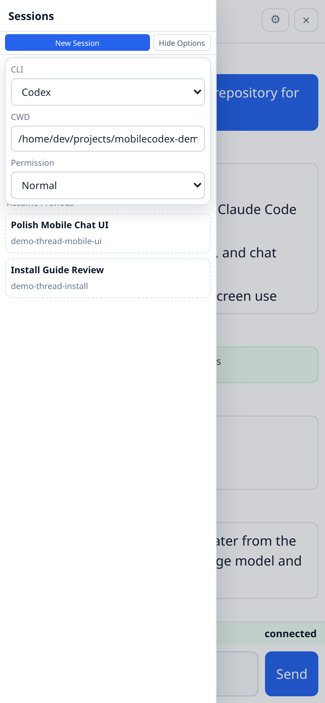
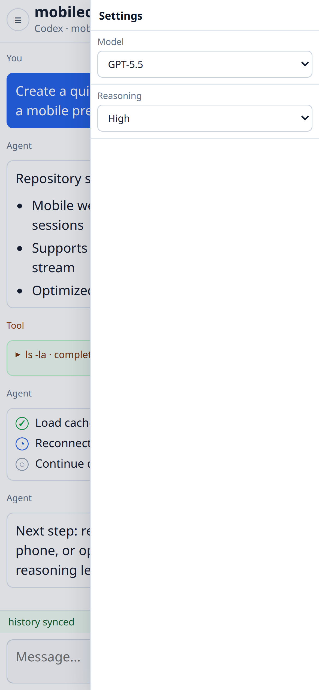

# MobileCodex

MobileCodex lets you control Codex CLI and Claude Code CLI from your phone.

## Why This Exists

The way we write code has changed. More developers now use coding agents such as Codex CLI and Claude Code CLI for real implementation work.

That changes what we need from a development machine. We still need a host machine to run the agent, hold the codebase, execute commands, and keep long-running work alive. But we no longer need to sit in front of that host machine just to interact with the agent.

MobileCodex exists for that workflow:

```text
your host machine runs the agent and code 24/7
your phone sends instructions whenever you want
the agent keeps working even when you leave the page
you come back later and resume the same session
```

It is not a phone IDE. It is a mobile control surface for Codex / Claude Code sessions running on your own machine.

## Preview

This recording shows a real MobileCodex session running against a tiny demo repository. The task is sent from the mobile chat UI, Codex updates `README.md`, runs `npm test`, and returns the result.

**Demo video:** [MP4](docs/media/previews/mobile-demo.mp4) · [WebM](docs/media/previews/mobile-demo.webm)

<video src="docs/media/previews/mobile-demo.mp4" controls width="390"></video>

| Chat | Sessions |
| --- | --- |
|  |  |

| New Session | Settings |
| --- | --- |
|  |  |

## Basic Architecture

The simplest setup is intranet-only:

```text
phone browser
  -> Tailscale
  -> http://<host-tailnet-ip>:8787
  -> MobileCodex host server
  -> Codex CLI / Claude Code CLI
```

You do not need a public domain, SSH from the phone, or HTTPS for the basic setup.

## Security Model

MobileCodex is designed to be reachable from your private Tailnet, not from the public internet.

The host server should bind to `0.0.0.0` so your phone can reach it over Tailscale, but the server only accepts requests from loopback and Tailscale IP ranges by default:

```text
127.0.0.0/8
::1/128
100.64.0.0/10
fd7a:115c:a1e0::/48
```

Requests from other IP ranges return `403 Forbidden`. This applies to both HTTP APIs and WebSocket session streams.

You can override the allowlist with:

```bash
MOBILECODEX_ALLOWED_CIDRS=127.0.0.0/8,::1/128,100.64.0.0/10,fd7a:115c:a1e0::/48
```

Do not set this to a public range unless you fully understand the risk. MobileCodex can start coding agents, send prompts, and affect files in allowed working directories.

If you put MobileCodex behind HTTPS or a reverse proxy, the reverse proxy must also enforce the same Tailnet restriction. The included Caddy setup blocks non-Tailscale client IPs before proxying to `127.0.0.1:8787`.

## 1. One Manual Step

Tailscale login cannot be completed by Codex or Claude Code for you.

Install Tailscale on:

- the host machine that will run Codex / Claude Code
- your phone

Log both devices in to the same Tailnet.

On the host, verify:

```bash
tailscale status
tailscale ip -4
```

If Tailscale is installed but not logged in, run:

```bash
sudo tailscale up
```

## 2. Copy This Prompt To Codex Or Claude Code

Open Codex CLI or Claude Code CLI on the host machine, then paste:

```text
Please install MobileCodex on this machine.

Repository:
https://github.com/capjason/mobilecodex

Goal:
- Install and run MobileCodex so I can open it from my phone over Tailscale.
- Use intranet HTTP by default. Do not require a domain, SSH from the phone, or HTTPS.
- Use HOST=0.0.0.0 and PORT=8787.
- Keep the default Tailnet-only allowlist. The server must allow loopback plus Tailscale IP ranges only, and return 403 for other client IP ranges.
- Use ~/workspace as the default working directory unless I already have a better local workspace path.
- Automatically install missing host dependencies where possible, including Node.js, npm, git, curl, tmux, Tailscale, Codex CLI, and Claude Code CLI.
- Install MobileCodex as a user auto-start service. Use systemd on Linux and LaunchAgent/launchd on macOS. This is required so the server keeps running after Codex/Claude Code exits.
- Do not wait for an interactive sudo password inside Codex/Claude Code. If privileged commands are needed and non-interactive sudo is unavailable, print the exact command I must run in a normal terminal, stop, and wait for me.

Instructions:
1. Clone or update the repository.
2. Read AGENTS.md and follow it.
3. Run scripts/bootstrap-host.sh.
4. Run scripts/install-service.sh. If the service cannot be installed automatically, tell me clearly that this step is unfinished and print exactly one command I must run in a normal terminal: `cd <repo> && scripts/install-service.sh`.
5. Run curl http://127.0.0.1:8787/api/health.
6. If Tailscale is not installed or not logged in, stop and ask me to complete that manual step. Do not try to handle browser login or account registration yourself.
7. Do not read, print, or commit real .env files, tokens, certificates, private keys, or shell history.
8. At the end, tell me the phone URL, preferably http://<tailscale-ip>:8787.
```

## 3. Optional HTTPS With A Domain

You do not need HTTPS if you are using Tailscale. Use this only if you already want a domain.

Human setup you must complete first:

1. Own a domain or subdomain, for example `mobilecodex.example.com`.
2. Point DNS `A` / `AAAA` records to the host's public IP.
3. Make sure ports `80` and `443` can reach the host.
4. Make sure no existing website or reverse proxy on that host will be overwritten.

Then paste this extra prompt to Codex or Claude Code:

```text
Please add HTTPS for MobileCodex.

Domain:
mobilecodex.example.com

Requirements:
- Keep the normal MobileCodex server on 127.0.0.1:8787.
- Use Caddy if there is no existing reverse proxy.
- Restrict HTTPS access to Tailscale client IP ranges only. Non-Tailscale IPs must receive 403.
- If an existing reverse proxy or Caddyfile is present, do not overwrite unrelated sites. Stop and show me the config block to merge.
- Do not wait for an interactive sudo password inside Codex/Claude Code. If privileged Caddy commands are needed and non-interactive sudo is unavailable, print the exact commands I must run in a normal terminal, stop, and wait for me.
- If this is a clean host and the existing Caddyfile is only the default placeholder, ask me before rerunning with OVERWRITE=1.
- Run scripts/install-https-caddy.sh with DOMAIN=mobilecodex.example.com.
- Verify with curl -k https://mobilecodex.example.com/api/health.
- Tell me the final iPhone URL.
```

The target shape is:

```text
https://mobilecodex.example.com
  -> reverse proxy
  -> http://127.0.0.1:8787
```

This is optional. Keep Tailscale/intranet HTTP as the default path unless you intentionally configure a domain.

## 4. Add To iPhone Home Screen

After MobileCodex opens in Safari:

1. Tap the share button.
2. Tap `Add to Home Screen`.
3. Keep the name `MobileCodex` or choose your own.
4. Open it from the Home Screen icon.

Tips:

- Use Safari for the first install. iOS Home Screen web apps are installed from Safari.
- Keep the host machine awake while long Codex / Claude Code tasks are running.
- If the app stops reconnecting after a network change, close it from the app switcher and open it again from the Home Screen.

## 5. Update And Restart

To update MobileCodex after it has already been installed, paste this prompt to Codex or Claude Code:

```text
Please update MobileCodex and restart the service.

Instructions:
1. Go to the existing MobileCodex repository checkout.
2. Read AGENTS.md and follow it.
3. Run scripts/update-and-restart.sh.
4. If the service cannot be restarted automatically, tell me clearly that the restart is unfinished and print exactly one command I must run in a normal terminal: `cd <repo> && scripts/update-and-restart.sh`.
5. Verify with curl http://127.0.0.1:8787/api/health.
6. Tell me when I can refresh the iPhone Home Screen app.
```

Manual command:

```bash
cd mobilecodex
scripts/update-and-restart.sh
```

## 6. Manual Commands

For humans or agents that prefer explicit commands:

```bash
git clone https://github.com/capjason/mobilecodex.git
cd mobilecodex
scripts/bootstrap-host.sh
scripts/install-service.sh
curl http://127.0.0.1:8787/api/health
```

For HTTPS after DNS is ready:

```bash
DOMAIN=mobilecodex.example.com scripts/install-https-caddy.sh
curl -k https://mobilecodex.example.com/api/health
```

Open from your phone:

```text
http://<host-tailnet-ip>:8787
```
